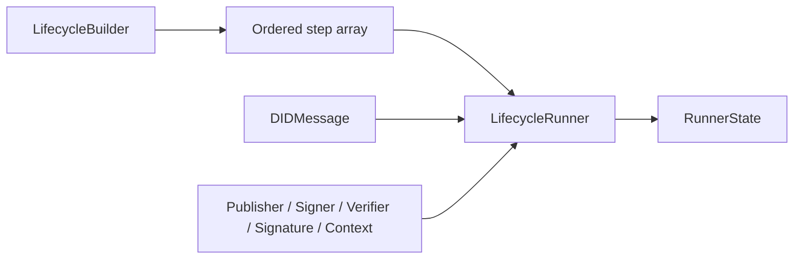
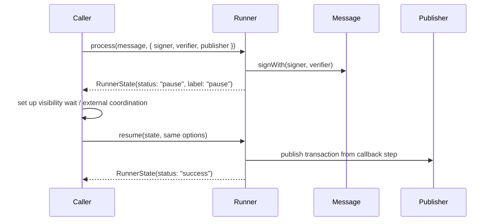
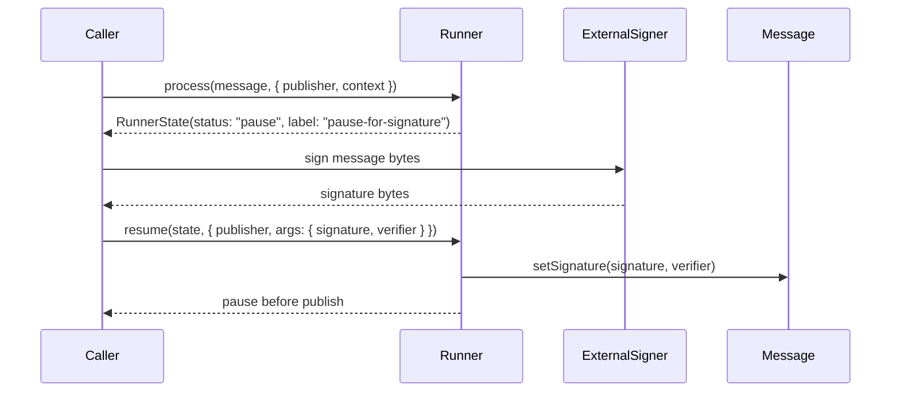

# Lifecycle Package Architecture

## Purpose

`@hiero-did-sdk/lifecycle` is the orchestration layer for multi-step DID operations in the Hiero DID SDK. It gives message packages a small declarative API for defining ordered workflows, then gives registrar and application code a runner that can execute those workflows, pause them, resume them, sign messages, attach externally produced signatures, and publish DID operation messages.

The package is intentionally narrow. It does not know how a specific DID message is built, how a Hedera transaction is submitted, or how a key is stored. Those details are supplied through `DIDMessage`, `Publisher`, `Signer`, `Verifier`, and optional operation context from `@hiero-did-sdk/core` and neighboring packages.

## Package Boundary

The package lives at `packages/lifecycle` and publishes the npm package `@hiero-did-sdk/lifecycle`.

Primary source files:

- `src/index.ts` exports the public surface.
- `src/builder.ts` defines `LifecycleBuilder`.
- `src/runner.ts` defines `LifecycleRunner` and `LifecycleRunnerOptions`.
- `src/interfaces/steps.ts` defines supported step types.
- `src/interfaces/runner-state.ts` defines runner state returned from process and resume operations.
- `src/interfaces/hooks.ts` defines completion hook callbacks.

Build and test files:

- `package.json` declares the package metadata, exports, scripts, and runtime dependencies.
- `tsdown.config.ts` reuses the repository-level build config.
- `tsconfig.json` and `tsconfig.build.json` configure TypeScript compilation.
- `vitest.config.ts` configures package tests.
- `tests/builder.spec.ts` covers builder behavior.
- `tests/runner.spec.ts` covers runner execution, pauses, resume behavior, error handling, signing, signatures, context, and hooks.

## External Dependencies

The lifecycle package depends on `@hiero-did-sdk/core` for shared contracts:

- `DIDMessage`: mutable DID operation message processed through the pipeline.
- `Publisher`: publisher used by callback steps and downstream workflows.
- `Signer`: signing provider used by `sign` steps.
- `Verifier`: verifier supplied when signing or attaching a signature.
- `DIDError`: SDK error type used for validation and runtime failures.

It also depends on `buffer` for browser-compatible bundle support through the shared build configuration.

The package does not directly depend on `@hiero-ledger/sdk`. Hedera-specific transactions are created by higher-level message lifecycle definitions and registrar operations.

## Public API

### `LifecycleBuilder<Message, Context>`

`LifecycleBuilder` owns the ordered lifecycle pipeline. It is generic over:

- `Message extends DIDMessage`: the message type that moves through the pipeline.
- `Context extends object = object`: optional operation-specific context passed to callback steps.

The builder exposes a fluent API:

- `callback(label, callback)` adds custom async or sync logic.
- `signature(label)` adds a step that attaches a caller-provided signature to the message.
- `signWithSigner(label)` adds a step that asks a supplied `Signer` to sign the message.
- `pause(label)` adds a resumable boundary.
- `catch(label, callback)` registers a single global error handler for the pipeline.

It also exposes lookup helpers:

- `length`
- `getByIndex(index)`
- `getByLabel(label)`
- `getIndexByLabel(label)`

Labels are the stable identifiers for steps. Normal pipeline steps must have unique labels. The current implementation validates labels only against pipeline steps; `catch()` stores its handler separately and can replace the existing catch handler.

### `LifecycleRunner<Message, Context>`

`LifecycleRunner` executes a `LifecycleBuilder` pipeline.

The main methods are:

- `process(message, options)`: starts at the beginning of the pipeline, or starts after `options.label` when resuming.
- `resume(state, options)`: continues from a previously returned pause state by calling `process(state.message, { ...options, label: state.label })`.
- `onComplete(label, callback)`: registers hooks that run after a step with the matching label is completed.

`LifecycleRunnerOptions` provides runtime dependencies:

- `publisher`: required for callback steps.
- `signer`: required for `sign` steps.
- `args.signature`: required for `signature` steps.
- `args.verifier`: required for both `sign` and `signature` steps.
- `label`: internal resume marker.
- `context`: optional operation-specific context passed to callbacks.

### `RunnerState<Message>`

Every successful runner call resolves to a state object:

```ts
type StateStatus = 'success' | 'error' | 'pause';

interface RunnerState<Message extends DIDMessage> {
  message: Message;
  status: StateStatus;
  index: number;
  label: string;
}
```

State meanings:

- `pause`: execution stopped at a pause step. `index` and `label` identify the pause.
- `success`: execution reached the end of the pipeline. `index` is `-1` and `label` is empty.
- `error`: a pipeline error was handled by a catch step. `index` is `-1` and `label` is empty.

If an error occurs and the builder has no catch step, the runner rethrows the original error.

## Core Runtime Model

The lifecycle runtime is a linear pipeline over a mutable message instance.



The runner processes each step in order:

1. Determine the starting index.
2. Load the current step from the builder.
3. If the previous step was a pause, run completion hooks for that pause label.
4. Execute the current step based on its type.
5. Run completion hooks for completed non-pause steps.
6. Return a pause state when a pause step is reached.
7. Return a success state after the final step.
8. If an error is thrown, call the catch handler when one exists; otherwise rethrow.

The message object is passed by reference. Callback, signing, and signature steps mutate the same message instance that is eventually returned in `RunnerState.message`.

## Step Types

### Callback Step

Callback steps execute SDK- or application-provided logic:

```ts
(message, publisher, context) => void | Promise<void>
```

They are used by message packages to perform operations such as:

- Setting the network on a message.
- Creating a Hedera topic.
- Checking whether a DID already exists.
- Publishing a message payload to a topic.

After the callback resolves, hooks registered for the callback label run in parallel through `Promise.all`.

### Sign Step

Sign steps call:

```ts
await message.signWith(options.signer, options.args.verifier);
```

They require both `options.signer` and `options.args.verifier`. Missing dependencies produce a `DIDError` with code `invalidArgument`.

This is the default server-side or SDK-managed signing path. The caller supplies a signer, and the lifecycle signs the mutable message before publication.

### Signature Step

Signature steps call:

```ts
await message.setSignature(options.args.signature, options.args.verifier);
```

They require both `options.args.signature` and `options.args.verifier`. Missing dependencies produce a `DIDError` with code `invalidArgument`.

This supports client-side signing mode, where the lifecycle pauses, the caller extracts the bytes to sign, an external system signs them, and the lifecycle later resumes with the signature bytes.

### Pause Step

Pause steps return immediately:

```ts
{
  message,
  status: 'pause',
  index: stepIndex,
  label: step.label,
}
```

No pause completion hooks run when the pause state is first returned. Hooks for a pause label run when execution is resumed and the runner is about to execute the next step. This makes the pause label mean "completed after resume", not "encountered before returning".

### Catch Step

Catch steps are stored outside the normal pipeline as `builder.catchStep`. They are global error handlers for the entire runner invocation.

When a pipeline step throws:

- If no catch step exists, the original error is rethrown.
- If a catch step exists, its callback receives the error and the runner returns an `error` state.

The catch handler does not receive the message, publisher, or context.

## Pause And Resume Flow

`resume()` is a thin wrapper over `process()`. It uses the paused state's label as the resume marker, and `process()` starts at the next step:

```ts
const initialStep = options.label
  ? builder.getIndexByLabel(options.label) + 1
  : 0;
```

Example default signing flow:



Example client-managed signature flow:



The second pause before publication lets callers prepare visibility waiting, auditing, user confirmation, or other coordination before the payload is submitted.

## Hooks

Hooks are stored on the runner, not the builder:

```ts
private readonly hooks: Record<string, HookFunction<Message>[]> = {};
```

Multiple hooks can be registered for the same label. They run in parallel and are awaited as a group.

Hook timing:

- Callback, sign, and signature hooks run immediately after their step completes.
- Pause hooks run after resume, just before the step following the pause executes.

Hooks are observational extension points. They receive only the message and should not be used as the primary place to encode required lifecycle behavior; required behavior belongs in explicit callback steps.

## Integration With Message Packages

The `packages/messages` package defines concrete lifecycle pipelines for DID message types. The lifecycle package supplies the primitives; message packages decide the actual steps.

Common default lifecycle pattern:

```ts
new LifecycleBuilder<Message>()
  .signWithSigner('signature')
  .pause('pause')
  .callback('publish-message', async (message, publisher) => {
    await publisher.publish(/* TopicMessageSubmitTransaction */);
  });
```

Common client-side signing lifecycle pattern:

```ts
new LifecycleBuilder<Message>()
  .pause('pause-for-signature')
  .signature('signature')
  .pause('pause')
  .callback('publish-message', async (message, publisher) => {
    await publisher.publish(/* TopicMessageSubmitTransaction */);
  });
```

The DID owner lifecycle has additional setup callbacks before signing:

- `set-network`
- `set-topic`
- `check-did-existence`

Those callbacks demonstrate why the lifecycle runner accepts `publisher` and generic `context`: some workflows need network access and operation-specific helpers before a message can be signed.

## Integration With Registrar Operations

Registrar operations consume lifecycles by creating a `LifecycleRunner` around a message lifecycle definition, building runner options, and driving pause/resume boundaries.

For example, create-DID default mode:

1. Build a `DIDOwnerMessage`.
2. Create a `Verifier` for the message public key.
3. Create `LifecycleRunner(DIDOwnerMessageHederaDefaultLifeCycle)`.
4. Call `process()` with `signer`, `publisher`, `context.topicReader`, and `args.verifier`.
5. Expect a `pause` state after signing.
6. Create a `MessageAwaiter` before publication.
7. Call `resume()` to publish the message.
8. Expect `success`.
9. Wait for DID visibility when requested.

This separation lets registrar code own operation orchestration and user-facing behavior while message packages own lifecycle definitions.

## Error Handling Model

The package has two error layers:

- Builder lookup and validation errors use `DIDError('internalError', ...)`.
- Runner dependency validation for sign/signature steps uses `DIDError('invalidArgument', ...)`.

Runtime callback errors, signing errors, and publishing errors are either:

- rethrown when no catch step exists, or
- passed to the catch callback when one exists, with an `error` state returned afterward.

The runner does not retry failed steps and does not persist partial execution state beyond the returned `RunnerState`.

## Build And Distribution

The package builds through `tsdown` using the repository-level config:

- Entry point: `src/index.ts`
- Output directory: `dist`
- Formats: CommonJS and ESM
- Target: `es2021`
- Node build: sourcemaps enabled
- Browser build: emitted to `dist/browser` with Node global/process/Buffer shims
- Declaration files: emitted for the Node build

`package.json` exports:

- `require`: `./dist/index.cjs`
- `import`: `./dist/index.mjs`
- `types`: `./dist/index.d.cts`
- `browser`: `./dist/browser/index.mjs`
- `react-native`: `./dist/browser/index.cjs`

The package requires Node `>=20`.

## Testing Strategy

The package tests focus on public behavior:

- Builder construction and empty length.
- Adding each step type.
- Step ordering and lookup by index or label.
- Duplicate label rejection.
- Catch-step registration and replacement.
- Runner execution of callback, sign, signature, and pause steps.
- Required dependency validation for sign and signature steps.
- Resume from paused states.
- Context propagation into callback steps.
- Hook ordering for normal steps and pause resume boundaries.
- Error handling with and without catch steps.

Higher-level lifecycle behavior is also tested from `packages/messages`, where concrete DID message lifecycles are run through `LifecycleRunner`.

## Design Constraints And Invariants

- Pipelines are linear. There is no branching, looping, or conditional step type.
- Pipeline step labels are unique within the normal pipeline.
- A builder has at most one active catch step.
- A runner is state-light. It stores hooks, but not the current execution pointer.
- The returned `RunnerState` is the resume token.
- The message is mutable and shared across every step.
- Callback steps are the only generic extension point inside the pipeline.
- Sign and signature steps require a verifier, so message mutation can validate the resulting signature path.
- Pause steps split one logical lifecycle across multiple runner calls.
- Hooks are registered per runner instance and are not part of the reusable builder definition.

## Current Limitations

- The lifecycle state is in-memory only. Persisting and restoring a paused state across processes is left to callers.
- There is no built-in timeout, cancellation, retry, or compensation mechanism.
- Catch handlers cannot recover and continue the pipeline; they only convert an error into an `error` state.
- Hooks receive only the message, not publisher, context, step metadata, or runner options.
- Hook callbacks are awaited in parallel, so hook side effects should be independent.
- `getByIndex()` rejects indexes greater than or equal to the pipeline length, but it does not explicitly reject negative indexes.
- `catch()` can reuse the same label and replace the existing catch step because catch handlers are not stored in the normal pipeline.

## Extension Guidance

When adding new lifecycle behavior:

- Prefer a callback step when the behavior is operation-specific.
- Add a new first-class step type only when the behavior is generic across many DID workflows.
- Keep new step contracts explicit in `LifecycleRunnerOptions`; avoid hidden globals.
- Preserve pause/resume semantics by making the returned `RunnerState` sufficient to continue.
- Add unit coverage in `packages/lifecycle/tests` for any new runner state, validation, or hook ordering behavior.
- Add integration coverage in message or registrar tests when the new behavior affects a concrete DID operation.
